<p align="center">
  
</p>

# SwiftTicket: Abreeza Cinema Reservation System

[](https://laravel.com)
[](https://www.php.net/)
[](https://opensource.org/licenses/MIT)
[](https://github.com/JKJapona/swiftticket-cinema-system/graphs/commit-activity)

**SwiftTicket** is a production-ready cinema management and ticketing platform engineered with **Laravel 12**. It delivers an end-to-end web architecture balancing a frictionless client-side layout with a deep data-driven admin subsystem to manage local cinema operations.

---

## 🚀 Live Deployment
**Production URL:** [https://swiftticket-cinema-system.onrender.com/](https://swiftticket-cinema-system.onrender.com/)  
> **Note:** Hosted on Render's Free Tier. If the site has been idle, please allow **30–60 seconds** for the cloud instance to spin up.

---

## 📸 System Previews

### Administrative Domain
| Dashboard Analytics & Server Load Status | Movies Management Catalog | Showtimes Scheduling Timeline |
| :---: | :---: | :---: |
| 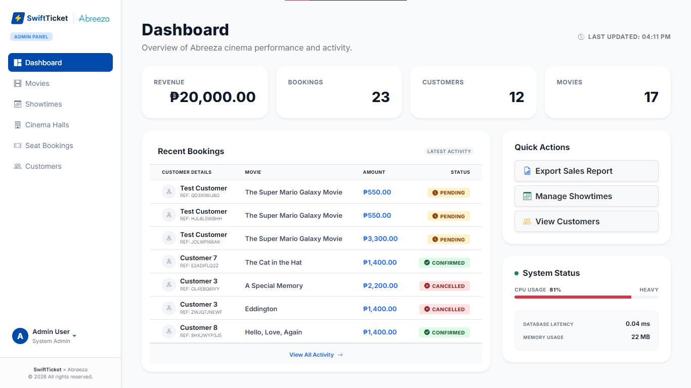 | 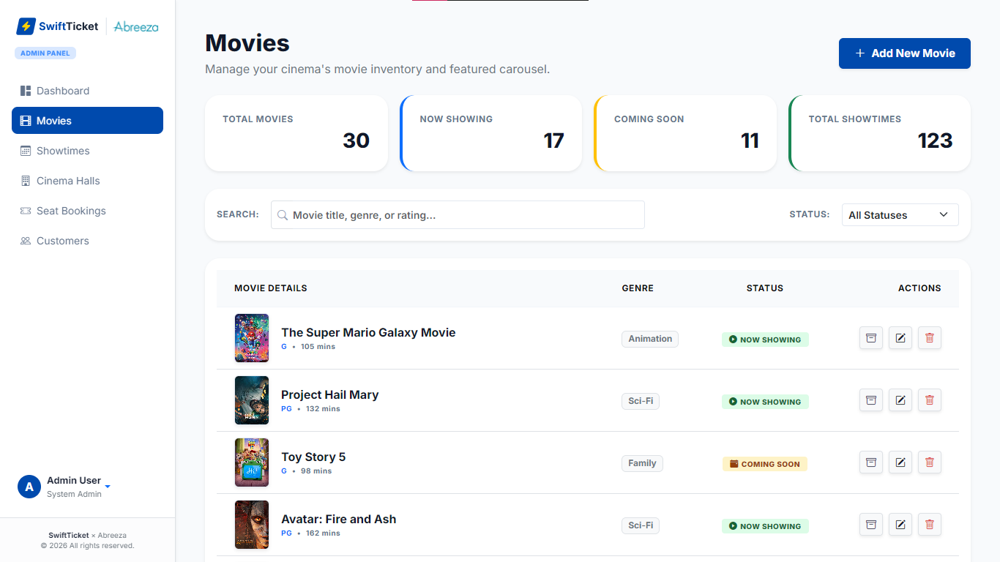 | 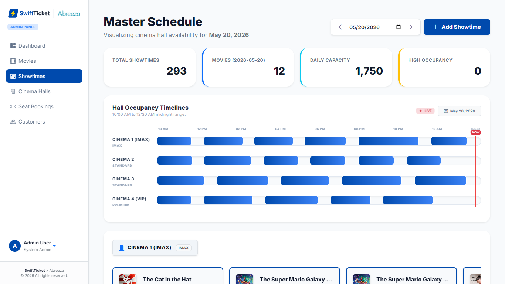 |

| Cinema Halls Configuration | Seat Bookings & Transaction Queue | Customers Account Administration |
| :---: | :---: | :---: |
| 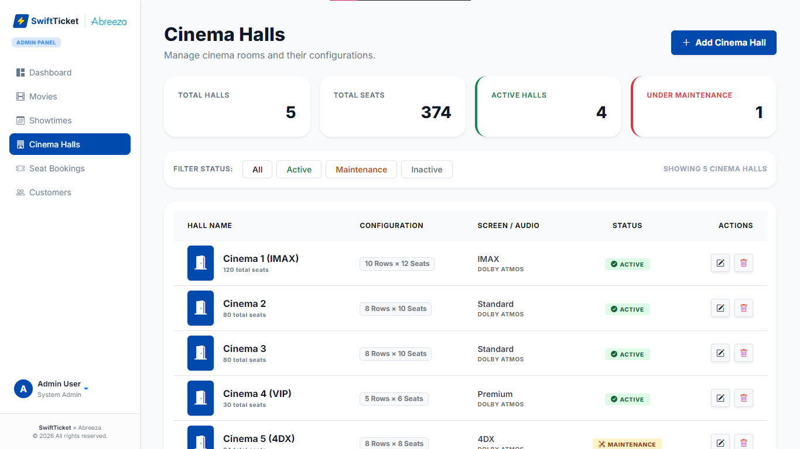 | 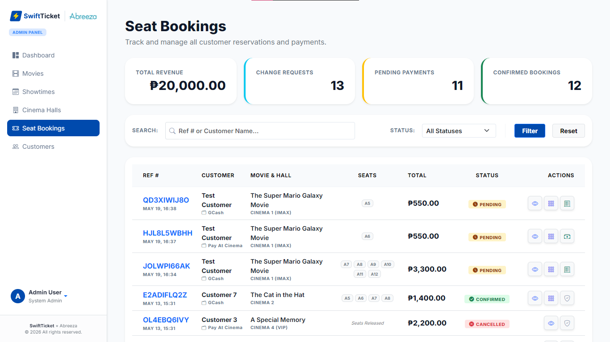 | 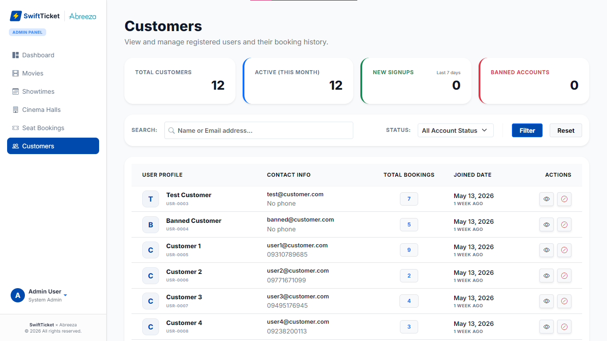 |

### Customer Domain
| Customer Home Page | Movie Details, Showtimes & Date Picker | Seat Selection Interface |
| :---: | :---: | :---: |
| 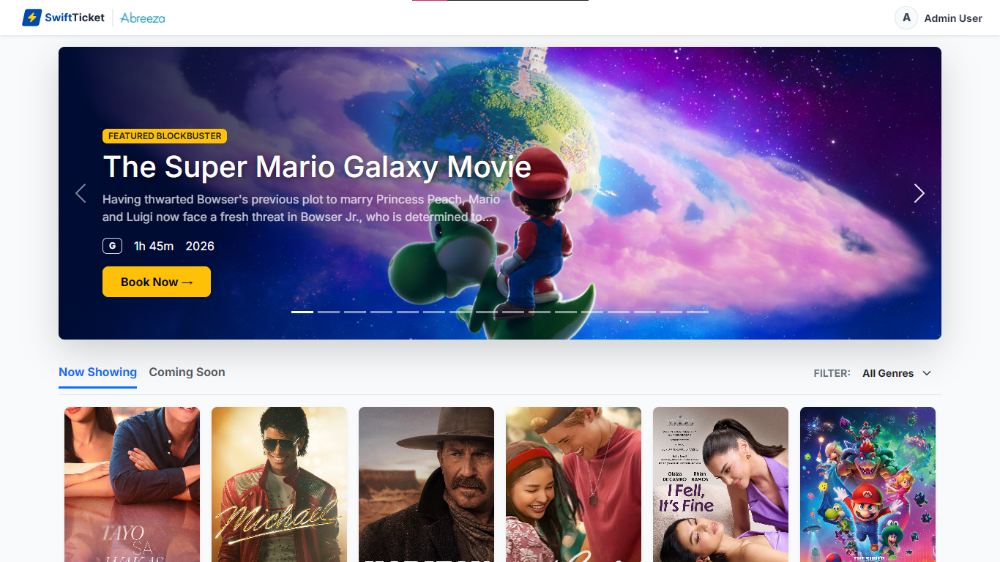 | 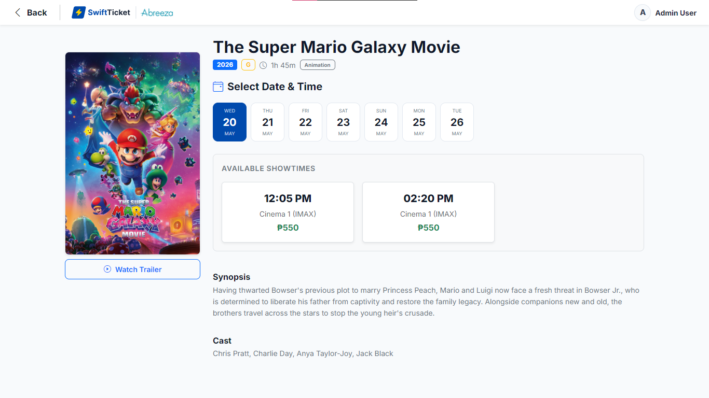 | 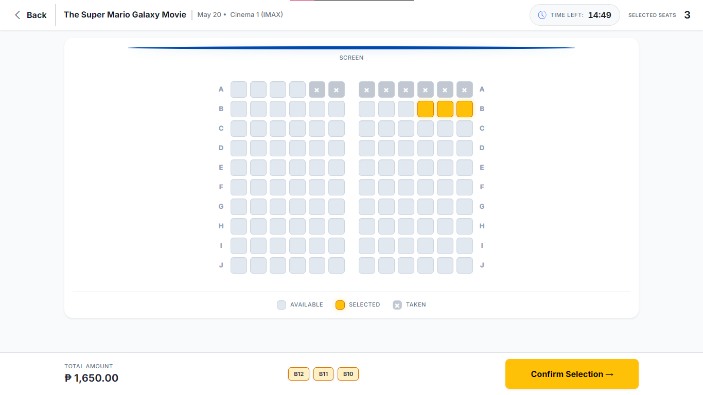 |

| Secure Payment Portal | Transaction Confirmation Screen | Profile Overview & Tickets Ledger | Profile Settings Dashboard |
| :---: | :---: | :---: | :---: |
| 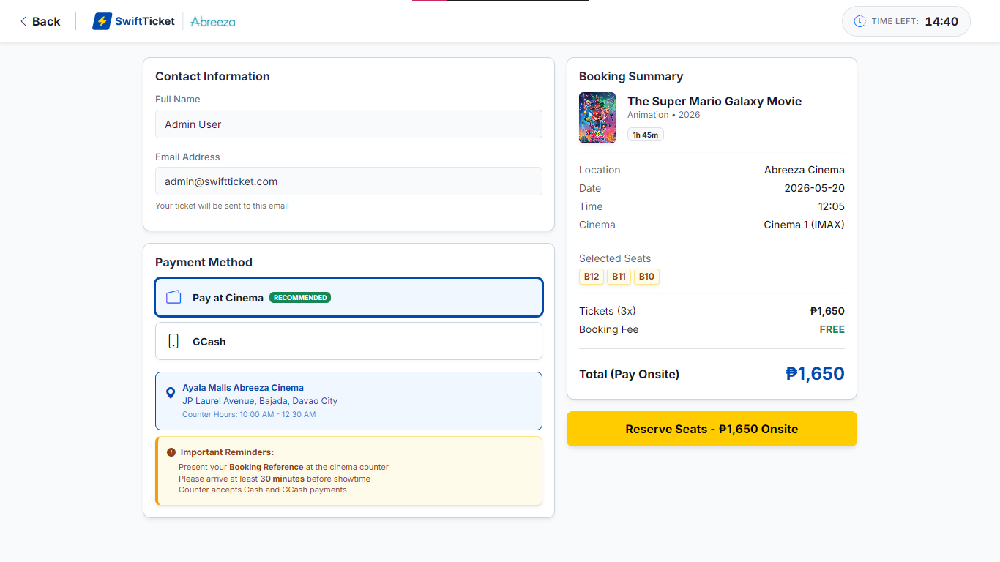 | 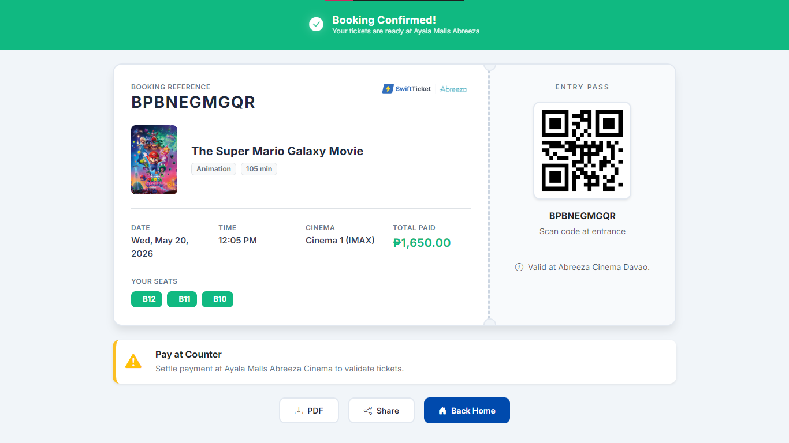 | 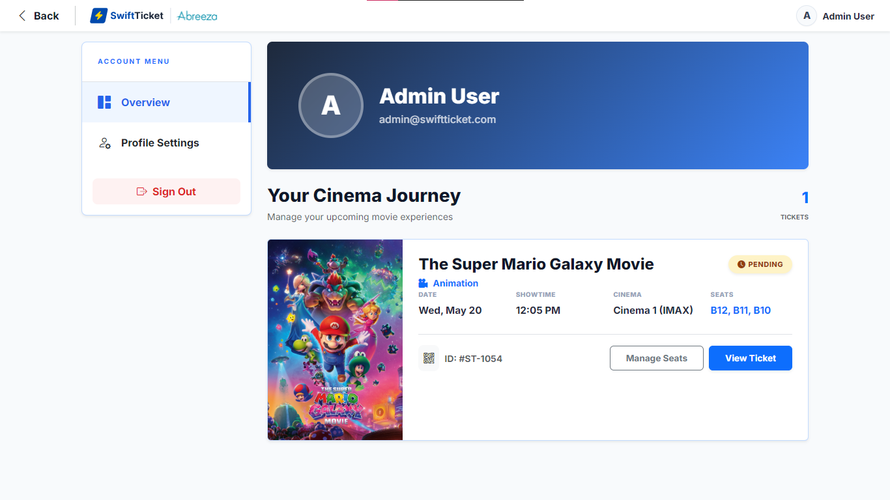 | 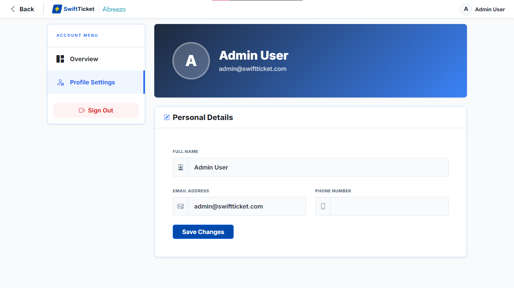 |

---

## 🛠️ Technical Architecture & Stack

| Layer | Technology | Operational Purpose |
| :--- | :--- | :--- |
| **Framework** | Laravel 12 (PHP 8.2+) | MVC Core architecture, Routing middleware, Eloquent ORM |
| **Database** | MySQL (Clever Cloud) | Fully normalized relational data storage engine |
| **Frontend** | Bootstrap 5, Vanilla JS, Native CSS | Responsive UI grid styling, client-side catalog filtering |
| **Asset Pipeline** | Vite | Compilation, asset minification, optimized loading speeds |
| **Deployment** | Render PaaS / GitHub Actions | Continuous Integration & Continuous Deployment (CI/CD) pipeline |

---

## 📅 Project Development Timeline

The design and implementation of SwiftTicket were executed systematically over a structured timeline following standard SDLC methodology frameworks:

<p align="center">
  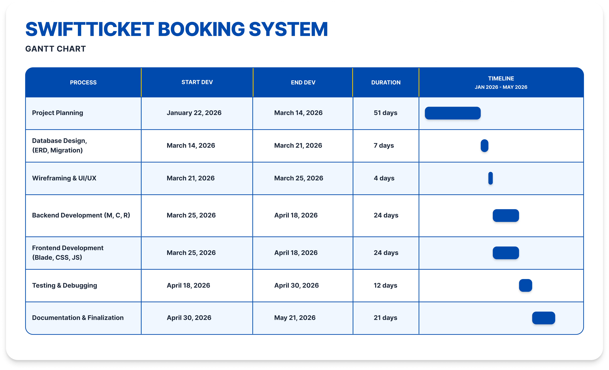
</p>

---

## 📦 System Modules & Feature Scope

### 1. Movie Catalog Management (`Movies`)
* **Admin Controls:** Full CRUD pipeline managing film entries (Title, duration strings, release timeline types, and graphic poster path attachments).
* **Customer Interface:** Interactive showcase sorting active titles dynamically into **Now Showing** vs. **Coming Soon** lists using optimized client-side JavaScript DOM element toggling.

### 2. Showtime Scheduling Engine (`Showtimes`)
* **Admin Controls:** Dynamic Gantt-style daily room occupancy chart plotting screening timelines (10:00 AM to 12:30 AM) with structural collision checks to prevent overlapping times.
* **Customer Interface:** Real-time date indicators mapping available screenings and ticket entry prices.

### 3. Cinema Hall Configuration (`Cinema Halls`)
* **Admin Controls:** Configuration console to generate virtual auditorium layouts by explicitly declaring capacity parameters (`number_of_rows * seats_per_row`). Tracks room statuses (`Active`, `Maintenance`).

### 4. Reservation & Transaction Ledger (`Seat Bookings`)
* **Admin Controls:** Reviewing transaction queues, approving or rejecting uploaded client GCash payment screenshots, and processing seat-change overrides.
* **Customer Interface:** Graphic node-based matrix rendering current seat availabilities (`Available`, `Selected`, `Taken`). Handles dual payment gateways (Pay at Counter vs. GCash attachment uploads) and outputs alpha-numeric references with integrated validation QR graphics.

### 5. Customer Registry & Security Controls (`Customers`)
* **Admin Controls:** Lifecycle governance engine over client records. Contains an instantaneous account restriction (Ban/Deactivate) utility toggle.
* **Security Middleware:** Custom application filters assess account states during login loops. Banned accounts are booted out of active sessions and intercepted at the access gateway.

---

## 🗄️ Database Schema Blueprint

The system utilizes a highly relational, fully normalized MySQL structure with strict cascading foreign key constraints to preserve referential integrity.

<p align="center">
  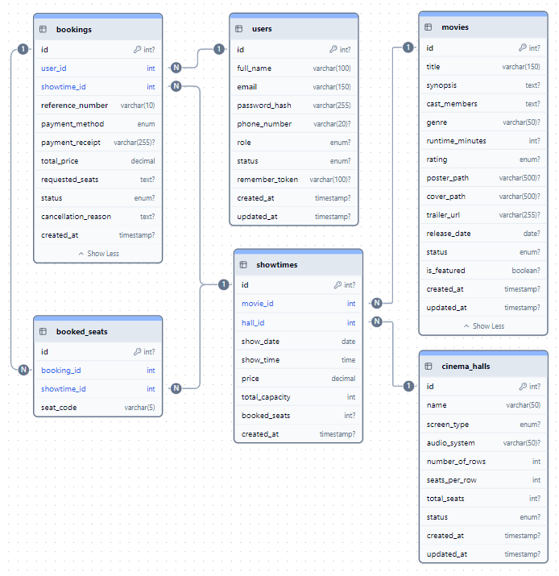
</p>

---

### 📁 Database Resource Assets
* **Raw Database File:** [Download database_schema.sql](./database/sql/database_schema.sql)  

### 🗄️ System Data Dictionary

The application's relational data layer is strictly structured to maintain transaction boundaries, support rapid querying for real-time seat tracking, and isolate administrative domains from client-facing flows.

| Database Table | Core Responsibility | Key Managed Fields & Structural Elements | System Impact |
| :--- | :--- | :--- | :--- |
| **`users`** | Identity & Access Management (IAM) | Credentials, `role` (Customer/Admin), `status` (Active/Banned) | Evaluated by auth middleware to grant panel entry or isolate restricted client traffic. |
| **`movies`** | Content Catalog Library | Runtime, rating class (`G` to `R-18`), `status` (Now Showing/Coming Soon), assets | Source definitions queried by dynamic client catalog filters and showcase sliders. |
| **`cinema_halls`** | Physical Venue Topographies | Dimensions (`number_of_rows` $\times$ `seats_per_row`), screen type (`4DX`, `IMAX`), `total_seats` (Virtual) | Defines the maximum capacity ceiling and structural layout boundaries for virtual seating matrices. |
| **`showtimes`** | Operational Scheduling Matrix | Composite scheduling keys (`movie_id` + `hall_id`), screen date/time window, ticket baseline tier rates | The transactional backbone connecting film media with open venue slots; enforces strict concurrency limits. |
| **`bookings`** | Ledger & Financial Receipts | Unique 10-digit text references, gateway choices (`GCash`/Counter), receipt file paths, transactional state badges | Tracks processing pipelines (`pending`, `confirmed`, `change_requested`) for admin validation. |
| **`booked_seats`** | Reservation Conflict Guard | Unique composite tracking index (`showtime_id` + `seat_code`) tied back to a parent booking entity | Isolation layer ensuring absolute row-column allocation exclusivity to prevent double-booking. |

---

## 💻 Local Installation & Setup Guide

Follow these sequential steps to deploy a development replica of SwiftTicket on your workstation:

### Prerequisites
* **PHP $\ge$ 8.2** (with required extensions: OpenSSL, PDO, Mbstring, XML)
* **Composer**
* **Node.js ($\ge$ 18.x) & NPM**
* **MySQL Server**

### Step-by-Step Deployment

1. **Clone the Repository:**
```bash
git clone https://github.com/JKJapona/swiftticket-cinema-system.git
cd swiftticket-cinema-system
```

2. **Install Backend Dependencies:**
```bash
composer install
```

3. **Install Frontend Dependencies:**
```bash
npm install
```

4. **Environment Initialization:**
```bash
cp .env.example .env
```

5. **Generate Security Cryptographic Key:**
```bash
php artisan key:generate
```

6. **Database Configuration:**
Open your local database client, initialize an empty schema named `swiftticket_db`, and update your `.env` file:
```env
DB_CONNECTION=mysql
DB_HOST=127.0.0.1
DB_PORT=3306
DB_DATABASE=swiftticket_db
DB_USERNAME=root
DB_PASSWORD=
```

7. **Execute Migrations and Data Seeding:**
```bash
php artisan migrate:fresh --seed
```

8. **Link Public Upload Storage:**
```bash
php artisan storage:link
```

9. **Launch Asset Compilers & Development Servers:**
Boot up Vite in one terminal window to manage reactive frontend styling:
```bash
npm run dev
```

In a separate terminal window, boot the native PHP routing service layer:
```bash
php artisan serve
```

Your application will be live at: `http://127.0.0.1:8000`

---

## 🔐 Sandbox Access Profiles

Use these pre-seeded diagnostic accounts to review functionalities across both application domains:

| System Domain | Authentication Email | Access Password | Clearance Privileges |
| :--- | :--- | :--- | :--- |
| **Administrative Panel** | `admin@swiftticket.com` | `password` | Complete system access CRUD capabilities |
| **Administrative Panel** | `admin.alt@swiftticket.com` | `password` | Backup administration profile |
| **Customer Portal** | `test@customer.com` | `password` | Active account with full booking access |
| **Intercept Gateway** | `banned@customer.com` | `password` | Simulates a restricted profile block |

---

## 📊 Repository Metrics
<p align="left">


</p>

---

## 👨‍💻 Engineering Team
Developed for the **College of Computing Education**.

* **Lead System Architect:** [Jheric Kent Japona](https://github.com/JKJapona)
* **Lead Supervisor:** Prof. Glenn Angelo Oliva

---
<p align="center">
  Built with ❤️ by Jheric Kent Japona | 2026
</p>